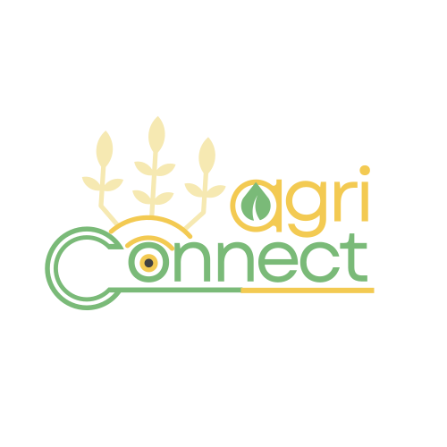
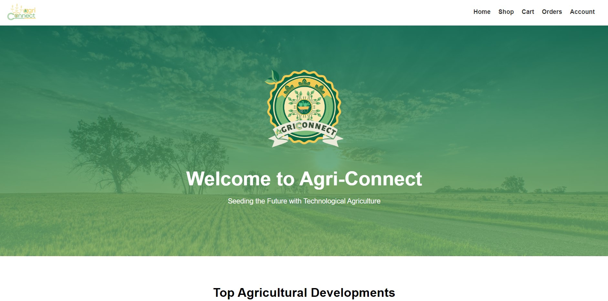

# AgriConnect



AgriConnect is a farm-to-table initiative by the Department of Agriculture. The project involves two user interfaces: one for merchants/admin (Department of Agriculture) and one for customers. This project aims to bridge the gap between farmers and consumers via e-commerce website.

## Project Structure

### Backend
- `controllers/`
- `index.js`
- `models/`
- `routes/`
- `test-requests.js`

### Frontend
- `components/`
- `images/`
- `pages/`
    - `Admin/`
    - `User/`
    - `Error/`
    - `Home/`
    - `Login/`
    - `Signup/`

## Prerequisites

- Node.js
- npm
- MongoDB
- React

## How to run

Follow these instructions to get a copy of the project up and running on your local machine.

### Backend Setup

1. Navigate to the backend directory:
   ```bash
   cd backend

2. Install the required dependencies

    ```bash
    npm i
3. Start the backend server using custom nodemon-powered script
    ```bash
    npm run server

### Frontend Setup
1. Navigate to the react-basics directory
    ```bash
    cd react-basics/

2. Install the required dependencies
    ```bash
    npm install

3.  Start the React Development Server
    ```bash
    npm run start
    


 ### Project Screenshots
- Login Page

    
)
- Signup Page
    
- Home Page
    
- Sample Product Listing Page
    
